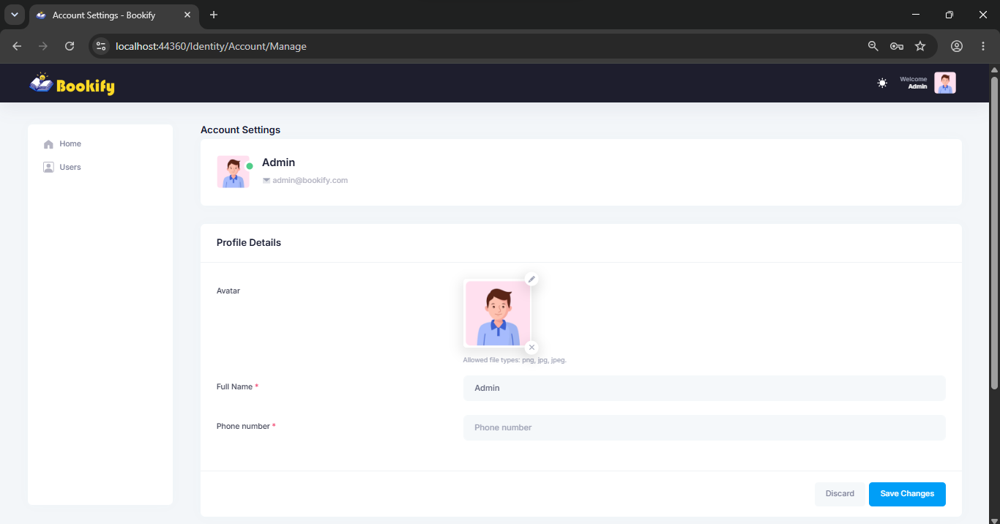

# 📚 Bookify: Library Management System

A modern library management system built with **ASP.NET Core MVC** for managing books, users, and borrow/return operations.

---

## 📸 Screenshots

### 🔐 Authentication
<table>
  <tr>
    <td width="50%" align="center"><b>Login</b></td>
    <td width="50%" align="center"><b>Email Confirmation</b></td>
  </tr>
  <tr>
    <td></td>
    <td></td>
  </tr>
</table>

 

### 👤 Profile
<table>
  <tr>
    <td width="50%" align="center"><b>Profile</b></td>
    <td width="50%" align="center"><b>Profile</b></td>
  </tr>
  <tr>
    <td></td>
    <td></td>
  </tr>
</table>

---

## ✨ Features

### ✅ Implemented
- 📖 **Book Management**
- 🔐 **User Authentication**
- 👥 **Role-Based Access Control** (Admin, Receptionist, Archivist)
- 🔄 **Borrow/Return System with subscriber management**
- ☁️ **Cloud-hosted book covers**
- ⚙️ **Automated background tasks using Hangfire**
- 🔍 **Advanced search & filtering**
- 📊 **Export reports (PDF/Excel)**

### 🔜 Planned
- Admin dashboard with analytics
- Apply the Repository pattern

---

## 🧰 Technology Stack

### Backend
| Technology |
| --- |
| ASP.NET Core MVC |
| Entity Framework Core |
| LINQ |
| AutoMapper \| Hangfire \| Data Protection API |
| SQL Server |
| ASP.NET Core Identity |

### Frontend
| Layer | Technology |
| --- | --- |
| **UI** | Razor Pages with Bootstrap 5, HTML and CSS |
| **Client-side** | jQuery |